# Online E-Shopping Store

A comprehensive web-based e-commerce application built using Java Servlets, JSP, and MySQL. This project has been updated to support containerized execution and automated CI/CD deployment pipelines on Amazon Web Services (AWS).

---

## 🚀 Features

### Customer Features
- **User Authentication**: Secure registration and login functionality.
- **Product Browsing**: Browse products by category.
- **Shopping Cart**: Add items to the cart, update quantities, and remove items.
- **Checkout & Payment**: Secure checkout process with payment integration.
- **Profile Management**: Update customer details.

### Admin & Manager Features
- **Product Management**: Add, update, and delete products.
- **Category Management**: Organize products into categories.
- **Manager Handling**: Manage store managers.
- **Inventory Control**: Monitor stock levels.

---

## 🛠️ Tech Stack

- **Backend**: Java 17 (Servlets), JDBC
- **Frontend**: JSP, HTML, CSS, JavaScript
- **Database**: MySQL 8.4 (AWS RDS / Local)
- **Containerization**: Docker
- **Build Tool**: Maven (POM dependencies configuration)
- **CI/CD Pipeline**: Jenkins (Declarative Pipeline)
- **Deployment Platform**: AWS EC2 (Ubuntu 22.04 LTS)

---

## 📂 Project Structure

```text
db/
└── gamudalk.sql         # Database schema and backup SQL file
src/
├── main/
│   ├── java/
│   │   ├── model/       # Data models (Product, Customer, etc.)
│   │   ├── services/    # Business logic (ProductService, etc.)
│   │   ├── servlet/     # Controllers (Servlets)
│   │   └── util/        # Utility classes (DBConnect.java)
│   └── webapp/          # Views (JSP), Styles (CSS), Scripts (JS)
├── Dockerfile           # Multi-stage build (Maven -> Tomcat JRE 17)
└── docker-compose.yml   # Local orchestration configuration
```

---

## ⚙️ Setup & Installation

### Option A: Local Development (Manual Tomcat)
1. **Prerequisites**: Java Development Kit (JDK) 17, Apache Tomcat 9.0, MySQL Server.
2. **Database Setup**: Create a local schema named `gamudalk` and import the table structures from `db/gamudalk.sql` in this repository.
3. Configure these environment variables for database credentials:
   * `DB_URL`: `jdbc:mysql://localhost:3306/gamudalk?characterEncoding=utf8`
   * `DB_USER`: Your MySQL username (defaults to `root`)
   * `DB_PASSWORD`: Your MySQL password
4. Run the project in Eclipse or your preferred IDE using **Run on Server** pointing to Tomcat 9.

### Option B: Local Development (Docker Compose)
If you have **Docker Desktop** installed, run the entire app and connect to a local database with one command:
```bash
docker-compose up --build
```
The application will be available at `http://localhost:8080`.

### Option C: AWS Production Deployment (Docker + Jenkins CI/CD)
To set up your database in **AWS RDS**, launch a host in **AWS EC2**, install Docker, configure Jenkins pipelines, and set up continuous integration, please follow our comprehensive step-by-step guide:

👉 **[AWS Deployment & CI/CD Guide (DEPLOY.md)](file:///c:/Users/chanuka/git/online-e-shopping-store/DEPLOY.md)**

---

## 📸 Screenshots


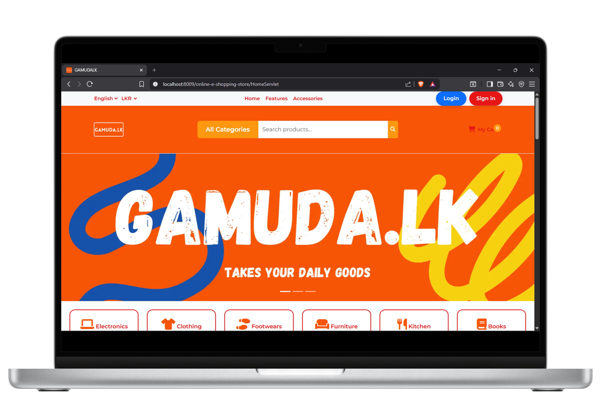
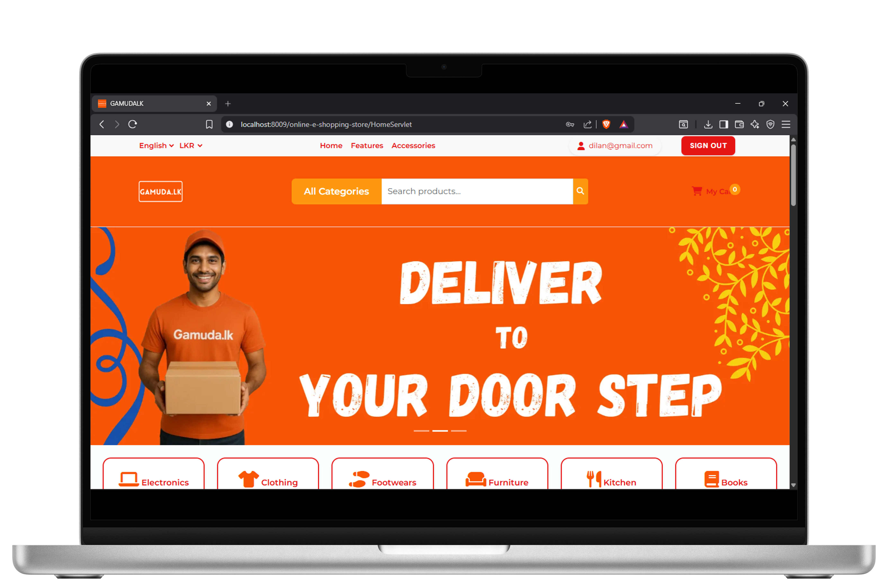
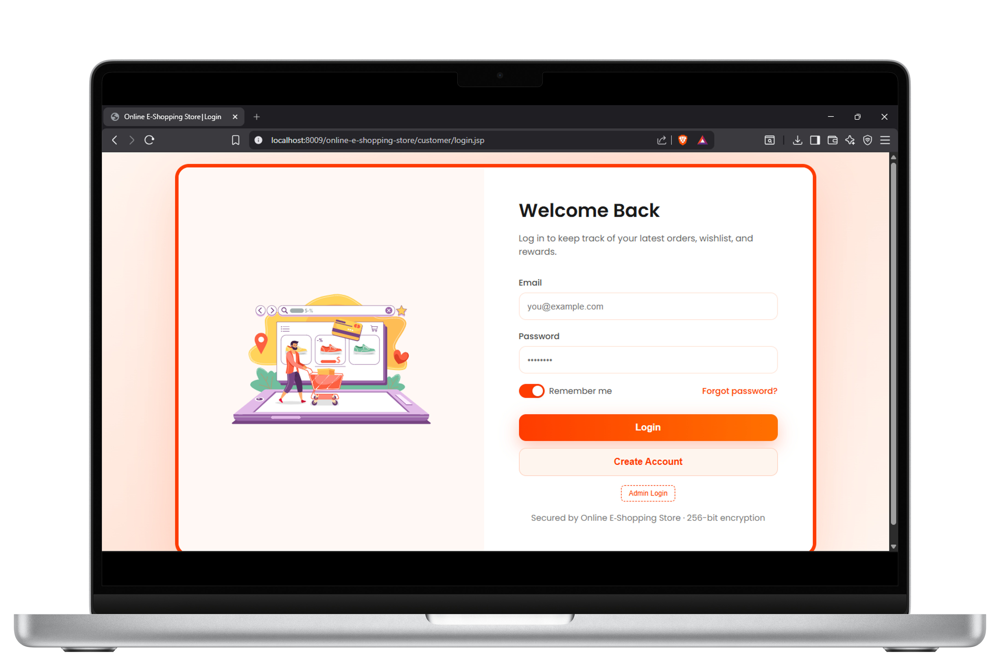
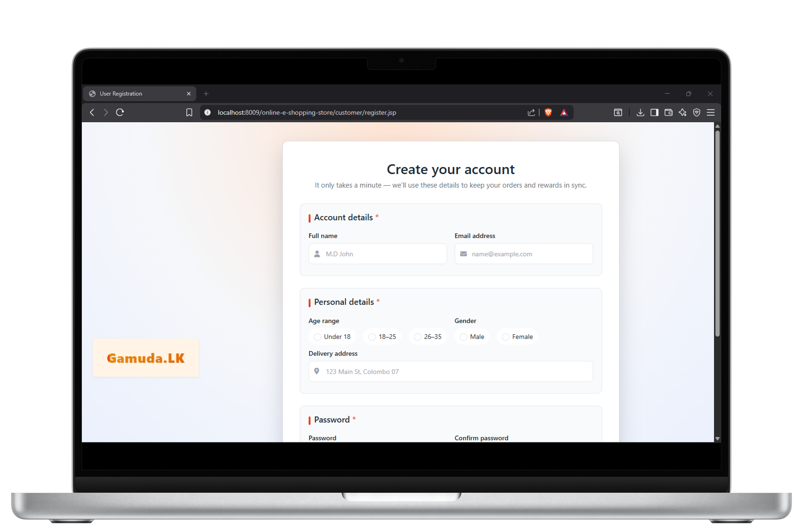
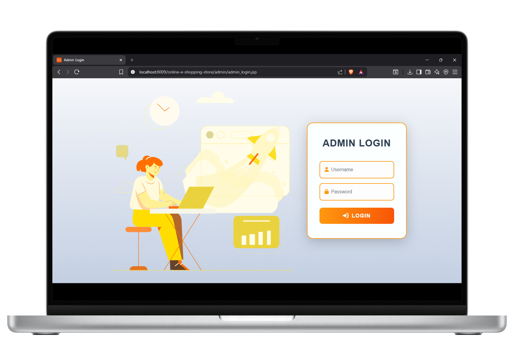
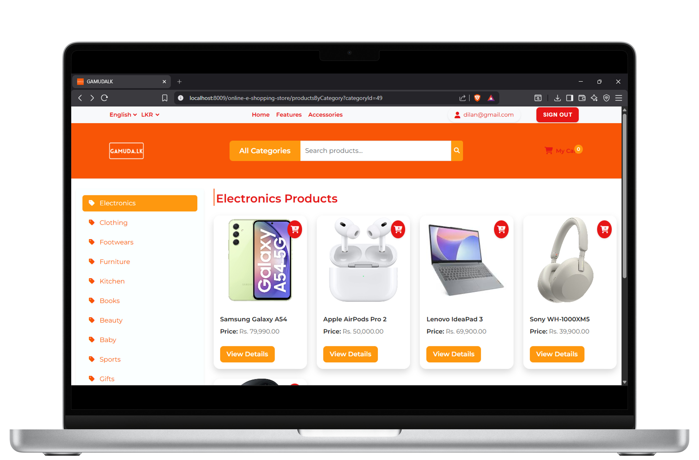
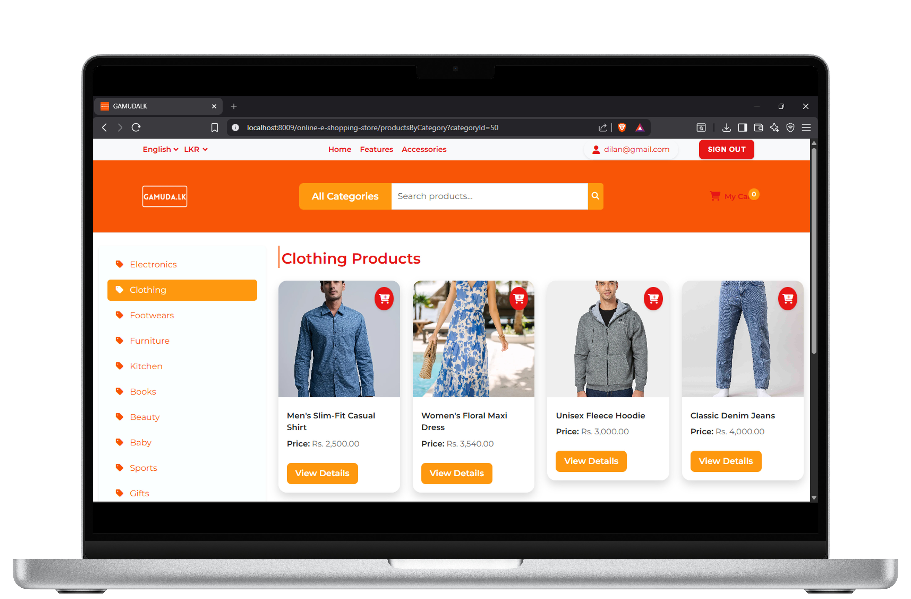
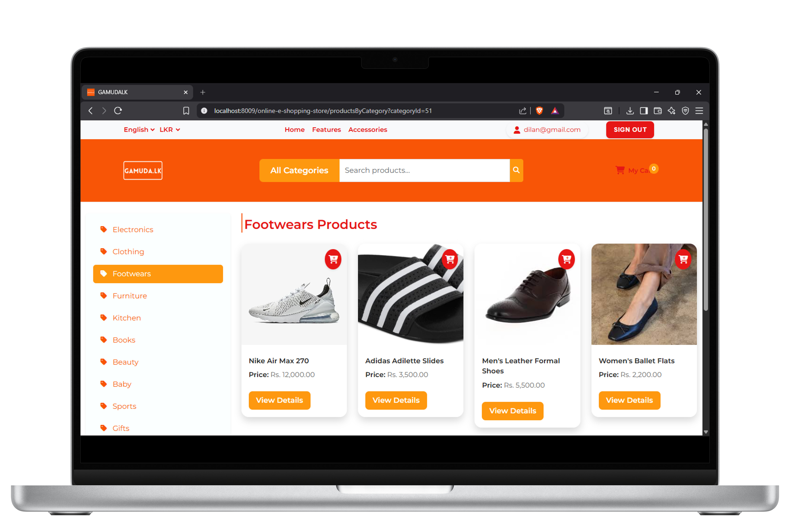
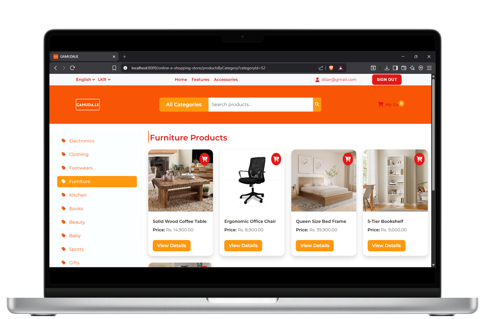
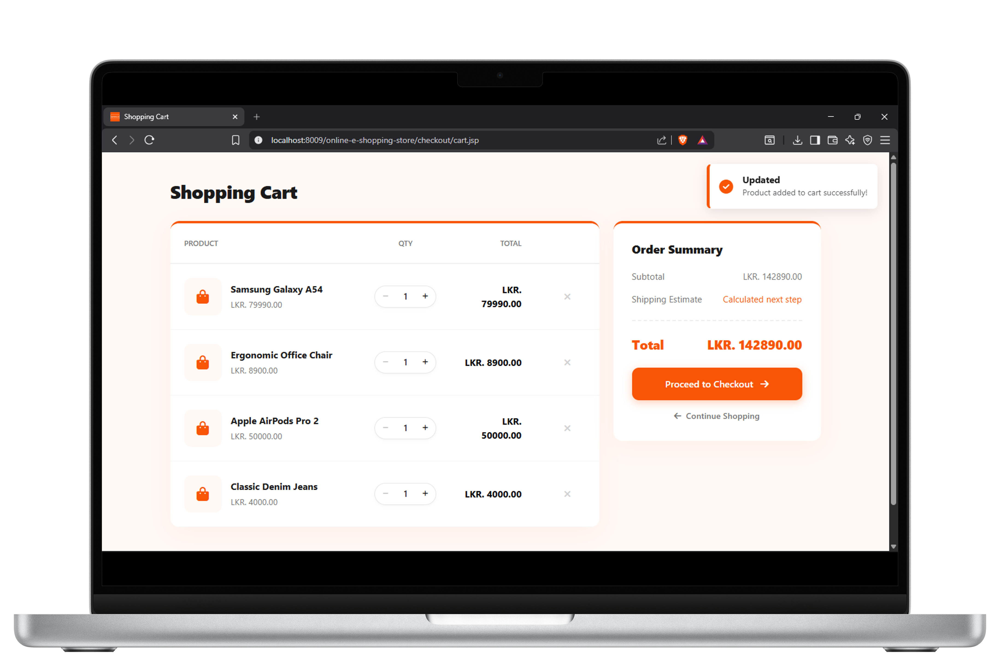
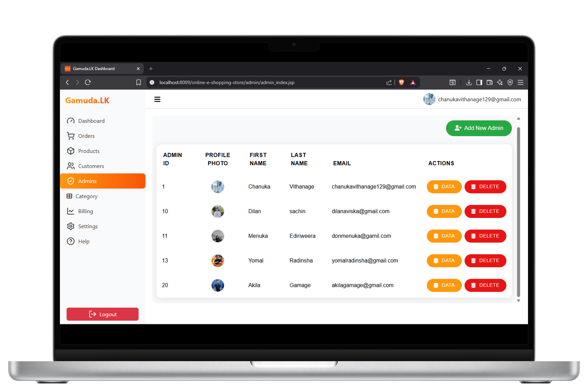
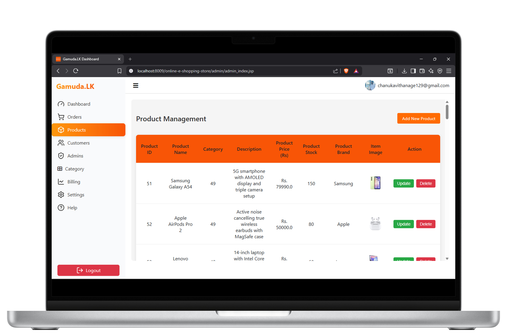
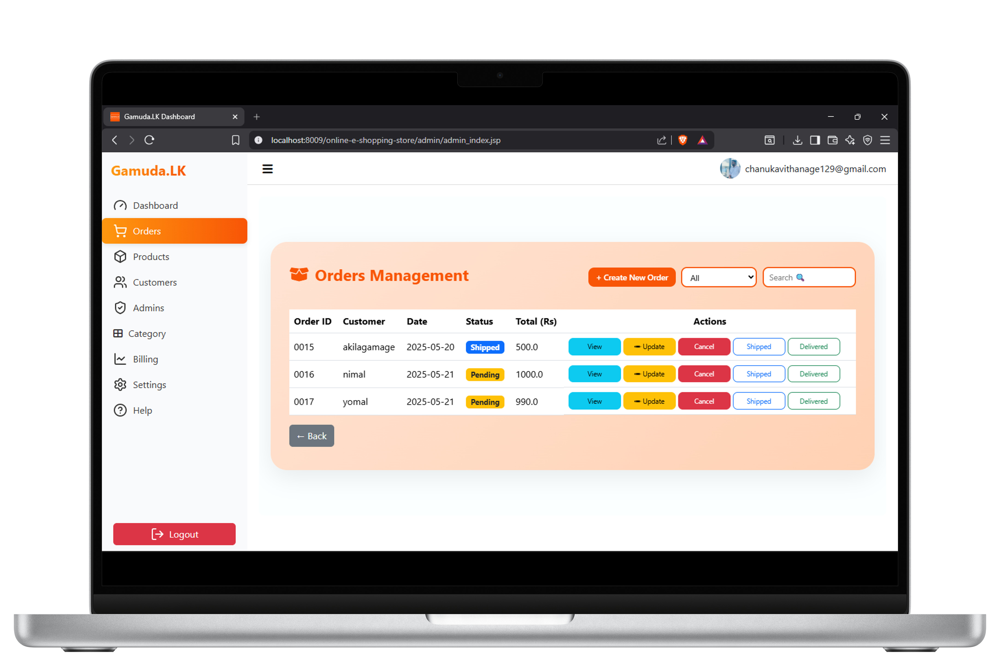
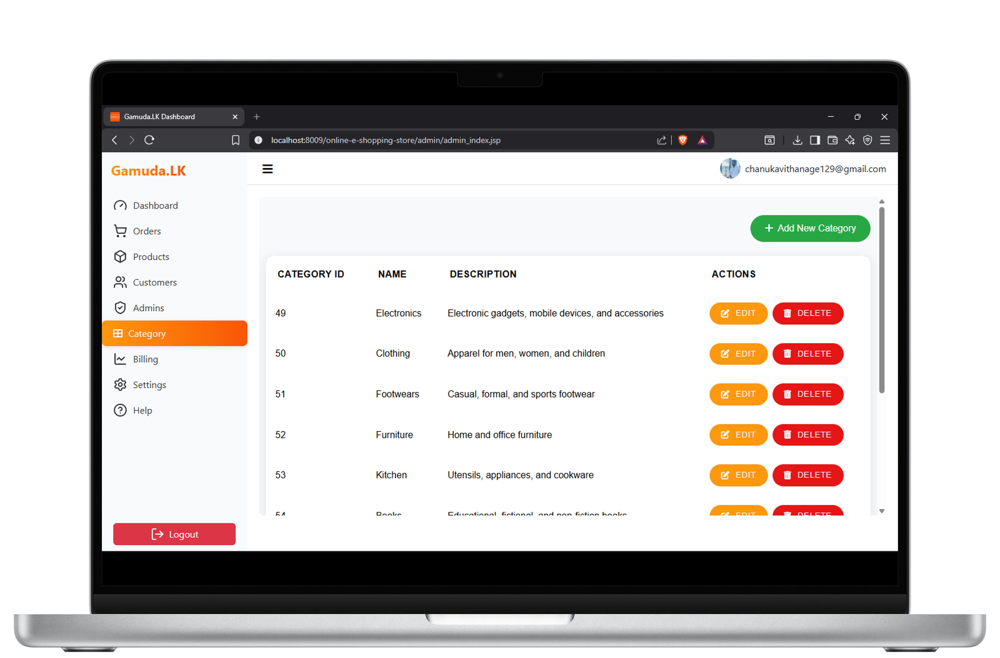

---

## 📄 License

This project is open-source and available under the [MIT License](file:///c:/Users/chanuka/git/online-e-shopping-store/LICENSE).
